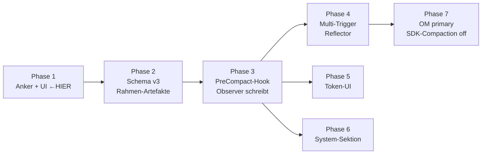

# Plan — Phase 1: Anker-Modell + UI-Fokus-Sektion

**Status:** Draft · **Erstellt:** 2026-05-06 · **Aktualisiert:** 2026-05-06 (nach Mastra-Studie) · **Session:** 260506-bold-reed

**Verwandte Dokumente:**
- [`mastra-om-study.md`](./mastra-om-study.md) — tiefe Code-Studie der Mastra-OM-Implementation; bestätigt das Anker-Konzept (entspricht Mastra's `threadId`/`resourceId`-Scope) und liefert Vorlagen für Phase 3+.

## 1. Ziel

Sessions in Orcha Agents bekommen explizite **Anker** auf Orcha-Artefakte (Feature, Befund, Anliegen). Damit:
- Sessions sind sichtbar **gruppiert** nach dem worauf sie sich beziehen
- Der Ledger trägt `anchorRefs` an jedem Signal/Candidate
- `episodic-summary` kann später über Anker (statt Zeit) aggregieren

Phase 1 schafft die **Grundlage** für alle weiteren Schritte. Sie ist **bewusst klein gehalten**: nur Datenmodell + UI, keine Observer/Reflector-Mechanik.

## 2. Out of Scope (für Phase 1)

- Observer/Reflector-Subagents (Phase 3-4)
- Schema v3 für Rahmen-Artefakte (Phase 2)
- PreCompact-Hook-Integration (Phase 3)
- Token-UI (Phase 5)
- Auto-Generierung von `episodic-summary` (Phase 4)

## 3. Datenmodell

### 3a. Session-seitig (Orcha Agents)

**Datei:** `packages/shared/src/sessions/types.ts` (vermutlich; sonst nächstes `Session`-Interface)

> **Konzeptueller Bezug zu Mastra:** Mastra's OM scoped Observations über `threadId` (lokal) und `resourceId` (übergreifend). Unser `AnchorRef` füllt beide Rollen — der Anker IST das Scope-Kriterium für später produzierte Observations. Damit ist Phase 1 nicht nur UI-Feature, sondern legt den **Scope-Anker** für die spätere OM-Pipeline.

```typescript
interface AnchorRef {
  type: 'feature' | 'befund' | 'anliegen'
  id: string                  // Orcha-Artefakt-ID — Scope-Schlüssel für spätere Observations
  title?: string              // Snapshot bei Anlage (für UI ohne Roundtrip)
  addedAt: string             // ISO timestamp
  addedBy: 'user' | 'agent'   // wer hat den Anker gesetzt
}

interface SessionMeta {
  // ... bestehende Felder
  anchors?: AnchorRef[]       // NEU
}
```

**Persistenz:** Bestehende Session-Persistenz erweitern. Jede Session-JSONL bekommt einen Header-Eintrag oder ein dediziertes `anchors`-Field im Session-Index.

### 3b. Ledger-seitig (Orcha CLI, separates Repo)

**Datei:** `~/Developer/orcha/packages/cli/src/lib/ledger.ts`

```typescript
// Erweiterung an RawSignal
interface RawSignal {
  // ... bestehende Felder (id, createdAt, source, summary, evidenceRefs, status)
  anchorRefs?: AnchorRef[]    // NEU — geerbt von Session
}

// Erweiterung an Candidate
interface Candidate {
  // ... bestehende Felder
  anchorRefs?: AnchorRef[]    // NEU — propagiert aus Signals
}

// Erweiterung an SyncRunState
interface SyncRunState {
  // ... bestehende Felder
  sessionAnchors?: AnchorRef[]  // NEU — vom CLI-Aufrufer übergeben
}
```

`ObligationEntry` bekommt **keinen** Anker — Obligations sind policy-getrieben und scope-übergreifend.

### 3c. Anchor-Snapshot-Konsistenz

`AnchorRef.title` ist ein **Snapshot bei Anker-Anlage**. Wenn das Original-Artefakt umbenannt wird, bleibt der Anker funktional (über `id`) aber zeigt im UI ggf. den alten Namen — bewusst, weil Refresh teuer und in Phase 1 unnötig ist.

## 4. UI-Sektion „Fokus"

### 4a. Sidebar-Layout — Unified Grouped View

Sessions und Anker leben in **einer** Liste; Anker sind Gruppen-Header. Default-Modus: **gruppiert nach Fokus**. Toggle zu flach (chronologisch) für „was hab ich heute gemacht".

```
┌────────────────────────────────────────┐
│ 🔍 Sessions suchen...                  │
│ Gruppieren ▾: nach Fokus        [+]    │
├────────────────────────────────────────┤
│ 📦 Modul-System v1     (3)          ▾  │  ← Gruppen-Header (Anker)
│   ● 260506-bold-reed    in progress    │
│   ○ 260507-quiet-lake   done           │
│   ○ 260510-warm-stone   draft          │
│                                        │
│ 🐛 Auth-Compliance     (1)          ▾  │
│   ● 260512-still-fox    in progress    │
│                                        │
│ 📥 Pocock-Adoption     (2)          ▸  │  ← collapsed
│                                        │
│ 📂 ohne Fokus          (2)          ▾  │
│   ○ 260420-quick-test                  │
│   ○ 260418-misty-cove                  │
├────────────────────────────────────────┤
│ ▸ SYSTEM                               │
└────────────────────────────────────────┘
```

**Alternativer Modus — flach, chronologisch:**

```
┌────────────────────────────────────────┐
│ 🔍 Sessions suchen...                  │
│ Gruppieren ▾: flach             [+]    │
├────────────────────────────────────────┤
│ ● 260506-bold-reed     📦 🐛           │
│ ● 260512-still-fox     🐛              │
│ ○ 260510-warm-stone    📦              │
│ ○ 260507-quiet-lake    📦  done        │
│ ○ 260420-quick-test                    │
│ ○ 260418-misty-cove                    │
└────────────────────────────────────────┘
```

**Verhalten:**
- **Default = Grouped nach Fokus** — spiegelt den Multi-Session-pro-Anker-Workflow
- Gruppen-Header zeigt Icon + Title + Counter aktiver Sessions
- Click auf Header → expand/collapse
- Click auf Header-Title (Phase 2+) öffnet Anker-Detail-Panel
- Multi-Anker-Session erscheint **unter allen** ihren Ankern
- „ohne Fokus"-Bucket sammelt Sessions ohne `anchors`
- `+`-Button öffnet Anker-Picker (siehe 4c)
- Toggle „Gruppieren" persisted per Workspace
- Sektion „SYSTEM" (collapsed default) — Phase 4 für Observer/Reflector

**Im flachen Modus:** Anker erscheinen als Inline-Chips rechts vom Session-Namen.

### 4b. Anker-Chip in Session-Detail

In der Session-Topbar oder unter dem Session-Titel:

```
260506-bold-reed
[📦 Modul-System v1] [🐛 Auth-Compliance] [+]
```

Chips sind klickbar (Filter), das `+` öffnet den Anker-Picker.

### 4c. Anker-Picker

Modal/Popover mit:
- Tab-Switcher: Feature / Befund / Anliegen
- Suchfeld (filtert nach Title)
- Liste der existierenden Artefakte aus Orcha (via `orcha feature list` etc.)
- „Neu anlegen" → öffnet Orcha-CLI-Befehl mit pre-filled `--title`

**Daten-Quelle:** Direkter `orcha`-Bash-Aufruf aus dem Main-Process. Eine MCP-Source existiert heute nicht und wird hier auch nicht eingeführt — Orcha Agents kommuniziert mit Orcha bereits über CLI, das bleibt der konsistente Pfad.

```typescript
// im Main-Process
async function listAnchorables(type: 'feature'|'befund'|'anliegen') {
  const { stdout } = await execAsync(`orcha ${type} list --json`)
  return JSON.parse(stdout)
}
```

In-Memory-Cache mit TTL ~30s, um Picker-Latenz zu glätten.

### 4d. Komponenten

Wir **erweitern die bestehende Session-Liste**, statt eine separate Sektion daneben zu bauen.

**Datei:** `apps/electron/src/renderer/components/app-shell/` (oder wo immer die Session-Liste heute lebt)

- **Erweiterung der Session-Liste** — neuer Modus `groupedByAnchor` (default) und `flat`
- `AnchorGroupHeader.tsx` — neu, Gruppen-Header mit Icon, Title, Counter, expand/collapse
- `AnchorChip.tsx` — neu, wiederverwendbarer Chip für Inline-Anzeige (flat-Modus + Session-Topbar)
- `AnchorPicker.tsx` — neu, Modal/Popover für Anker-Wahl
- `GroupingToggle.tsx` — neu, Dropdown „Gruppieren ▾"

**Datei:** `apps/electron/src/renderer/components/sessions/`

- `SessionAnchorBar.tsx` — neu, Topbar-Komponente in Session-Detail, listet Anker der aktiven Session

## 5. CLI-Integration (Orcha)

**Datei:** `~/Developer/orcha/packages/cli/src/commands/sync.ts`

Neue Option:
```
orcha sync --anchor feature:abc123 --anchor befund:def456
```

Diese Anker werden:
1. In `syncRunState.sessionAnchors` geschrieben
2. An jedes neu erzeugte `RawSignal` propagiert (wenn Signal keine eigenen hat)
3. An jeden neu erzeugten `Candidate` propagiert

**Datei:** `~/Developer/orcha/packages/cli/src/lib/signals.ts`

- `addSignal()` akzeptiert optional `anchorRefs`
- Default: erbt von `ledger.syncRunState.sessionAnchors`

## 6. Bridge: Orcha Agents → Orcha CLI

Wenn der Agent in einer Session mit Anker `orcha sync` ausführt, muss er die Anker als CLI-Argumente weiterreichen. Zwei Wege:

**A) Environment-Variable (einfach):**
```
ORCHA_SESSION_ANCHORS='[{"type":"feature","id":"abc"}]' orcha sync
```
CLI liest Env, schreibt in `sessionAnchors`. Nutzer muss nichts tun.

**B) Skill-erzwungen (sauberer):**
Im Skill `orcha-sync.md` (oder System-Prompt) wird vorgegeben: „Bei `orcha sync` immer `--anchor`-Flags aus Session-Metadata."

**Empfehlung:** A für Phase 1 — niedrigste Reibung, deterministisch. B kann später ergänzt werden.

## 7. Migration

### 7a. Bestehende Sessions

- Sessions ohne `anchors`-Field landen in Bucket „ohne Fokus"
- Kein Auto-Backfill — wir versuchen **nicht**, retroaktiv zuzuordnen

### 7b. Bestehender Ledger

- `RawSignal` und `Candidate` ohne `anchorRefs` bleiben gültig (Field optional)
- Keine Schema-Migration nötig — additive Erweiterung
- Sync-History bleibt unverändert (kein Anker-Field dort in Phase 1)

## 8. Tests

### 8a. Unit (Orcha Agents)

- `Session.setAnchors()` validiert Anker-Form (type ∈ {feature, befund, anliegen})
- Sidebar-Filter zeigt nur Sessions mit passendem Anker
- „ohne Fokus"-Bucket = Sessions mit leerem oder fehlendem `anchors`

### 8b. Unit (Orcha CLI)

- `sync --anchor feature:x` schreibt `sessionAnchors`
- `addSignal` ohne explizite `anchorRefs` erbt von `sessionAnchors`
- Migration v2 → v2 (additiv) verliert keine Daten

### 8c. End-to-end

- User erstellt Session, setzt Anker `feature:foo`
- `orcha sync` läuft, schreibt Signals mit `anchorRefs`
- Sidebar zeigt Session unter `Modul-System v1` (foo's Title)

## 9. Risiken & offene Fragen

| Risiko | Mitigation |
|---|---|
| Anker-IDs werden in Orcha gelöscht, Sessions zeigen tote Refs | UI zeigt grayed-out chip mit „(removed)"; löschen erlaubt |
| Snapshot-`title` driftet von echtem Title | Bewusster Trade-off; Phase 2 kann optional refreshen |
| User vergisst Anker zu setzen | Default-Verhalten OK (Bucket „ohne Fokus") — keine Pflicht |
| Multi-Anker-Session: wo wird sie gelistet? | Unter **allen** ihren Ankern (Counter zählt sie mehrfach) |

**Offene Fragen:**
- Soll der Anker-Picker auch Tasks und Milestones anbieten? (Vermutung: nein, Anker = Episode-Ebene; Tasks sind Sub-Ebene)
- Soll es einen „Default-Anker pro Workspace" geben? (Ablehnen für Phase 1)

## 10. Aufwand-Schätzung

| Bereich | Aufwand |
|---|---|
| Datenmodell (Session + Ledger) | 0.5 d |
| CLI-Erweiterung (sync, signals) | 0.5 d |
| UI-Komponenten (Liste-Erweiterung + 4 neue) | 1.5 d |
| Anker-Picker + CLI-Datenquelle (mit Cache) | 1.0 d |
| Bridge (Env-Var) | 0.25 d |
| Tests | 0.5 d |
| **Gesamt** | **~4 d** |

## 11. Akzeptanzkriterien

- [ ] Session kann Anker (Feature/Befund/Anliegen) zugewiesen bekommen
- [ ] Session-Liste hat Modus „gruppiert nach Fokus" (default) und „flach" (toggle)
- [ ] Anker erscheinen als Gruppen-Header mit Counter und expand/collapse
- [ ] Multi-Anker-Sessions erscheinen unter allen ihren Ankern
- [ ] „ohne Fokus"-Bucket existiert
- [ ] Im flachen Modus: Anker als Inline-Chips an Session-Items
- [ ] Session-Topbar zeigt aktive Anker als Chips
- [ ] Anker-Picker liest existierende Orcha-Artefakte via CLI (mit Cache)
- [ ] `orcha sync` propagiert Session-Anker in `RawSignal.anchorRefs`
- [ ] Tests grün, keine Regressionen am bestehenden Sync-Pfad
- [ ] Keine Pflicht — Sessions ohne Anker funktionieren weiter wie heute

## 12. Folge-Phasen (zur Orientierung)



Phase 1 ist Voraussetzung für 2-7. Schritte 5 und 6 sind unabhängig nach Phase 3 möglich.

### 12a. Mastra-Erkenntnisse für Folge-Phasen

Aus `mastra-om-study.md` adaptieren wir konkret in:

**Phase 3 (PreCompact-Hook + Observer)**
- Observer-Modell: **Haiku 4.5 oder Gemini Flash** als Default (nicht Opus) — Mastra nutzt `gemini-2.5-flash` mit temp 0.3. Ökonomisch entscheidend.
- Observer-Output-Format: **Strukturierter Text mit Emoji-Priorities (🔴/🟡/🟢)** + Zeitstempel + `<thread id>`-Attribution. Pragmatischer als JSON.
- Anker = Mastra-Thread: `<thread id="feature:abc">` als Attribution-Tag in jeder Observation.
- Observer-Prompt-Kernregeln (übernehmen):
  - „Assertions vs. Questions unterscheiden"
  - „USER ASSERTIONS TAKE PRECEDENCE"
  - „State Changes als Überschreibungen darstellen" (nicht Append)
  - „Präzise Verben statt Substantive"
  - „Multiple Events splitten"
- Recall-Mechanismus: `<observation-group range="id1:id2">` mit `recall()`-Tool als Sicherheitsnetz für gedroppte Originale (Phase 3b oder Phase 7).

**Phase 4 (Multi-Trigger + Reflector)**
- **`ThresholdRange {min, max}` mit `shareTokenBudget`** statt statischer 30k/40k. Adaptive Threshold gibt ungenutzten Observation-Platz an Messages zurück.
- **5 Compression Levels (0-4)** mit Degeneration Detection: wenn Reflector-Output zu repetitiv wird, Retry mit höherem Level. Schützt vor Information-Loss.
- Reflector-Output-XML-Struktur: `<observations>`, `<current-task>`, `<suggested-response>` — übernehmen.
- Reflector-Prompt-Kernregel: „Your reflections are THE ENTIRETY of the assistant's memory" — schärft die Verantwortung.

**Persistenz (cross-cutting, beeinflusst Phase 3 + 7)**
- `OrchaObservationRecord` analog zu Mastra's `ObservationalMemoryRecord`:
  - `generationCount` (inkrementiert pro Reflection)
  - `originType: 'initial' | 'reflection'`
  - `scope: { anchorRefs: AnchorRef[] }` (anstelle von Mastra's threadId/resourceId)
  - `activeObservations`, `bufferedChunks`, `tokens`
- Bridging zum bestehenden Ledger: Ledger bleibt strukturierte Pipeline (signals/candidates/obligations); OM-Observations sind eine **zweite Ebene** für Conversation-Kompression. Kein Konflikt.

### 12b. Was wir NICHT von Mastra übernehmen

- **Volle Mastra-Framework-Dependency**: Wir nutzen das Pattern, nicht das Paket. Eigener Code mit Apache-2.0 Attribution.
- **Mastra's Storage-Abstraktion**: Wir bleiben bei JSON-Files für Ledger; Observations können in dieselbe Datei oder eine zweite (`.orcha-observations.json`) — entscheidet Phase 3.
- **Working-Memory als separates System**: Phase 1-4 fokussiert auf OM (Vergangenheit). Working-Memory-Pattern (Gegenwart) ist Phase 7+ optional.
